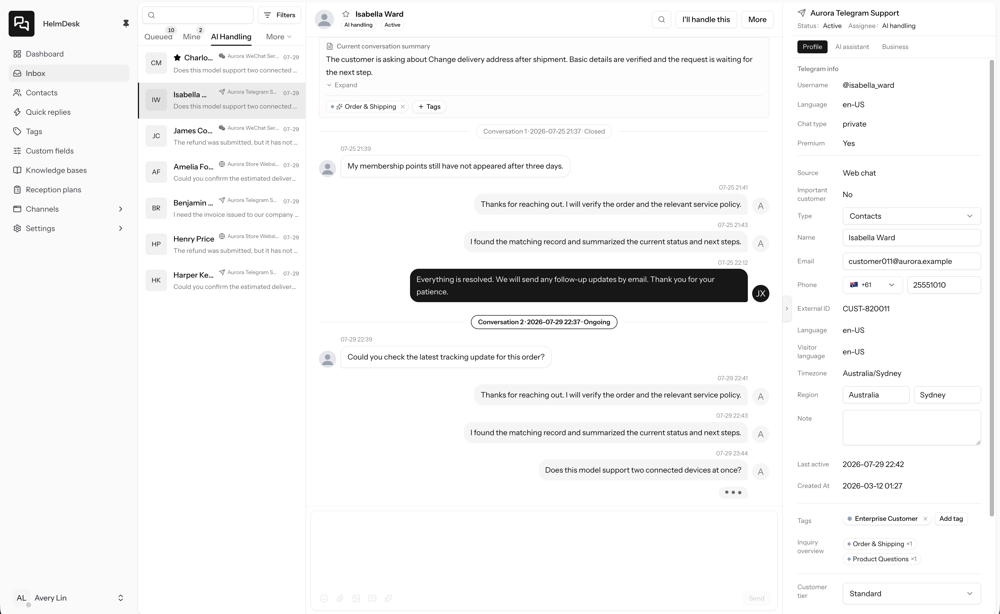
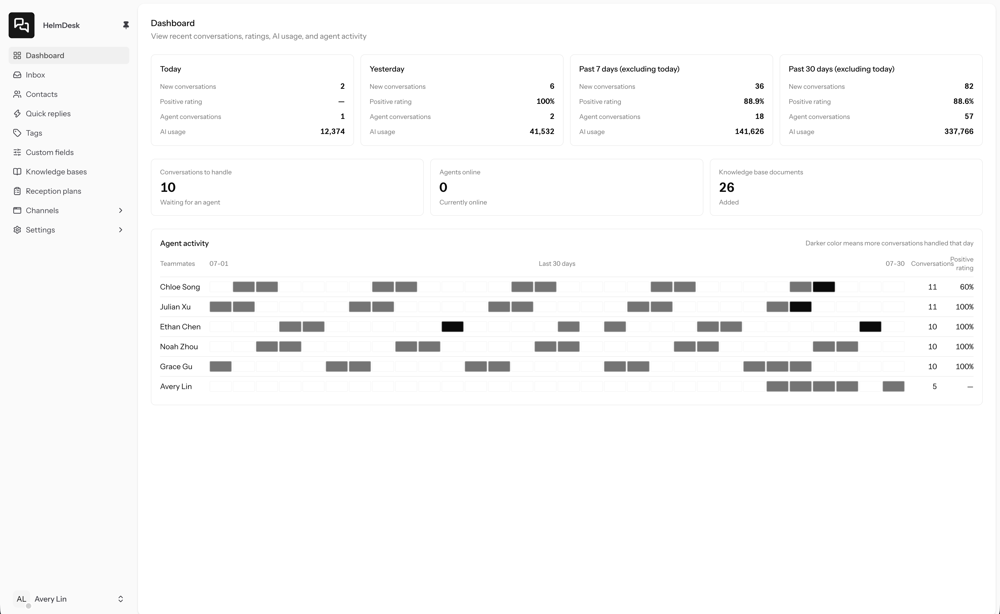
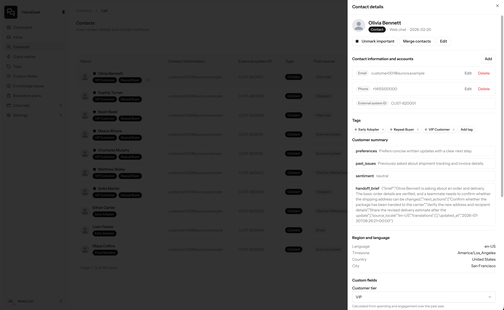
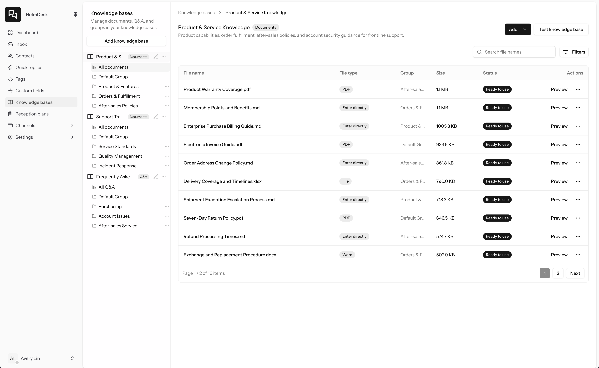
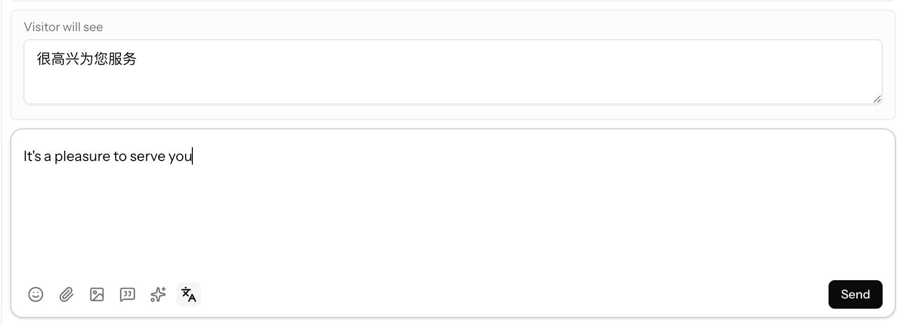
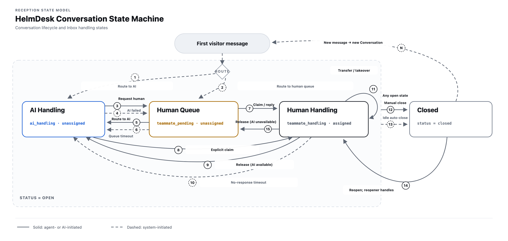

# HelmDesk

English | [简体中文](README.zh-CN.md)

HelmDesk is an open-source, self-hosted, AI-native customer support system for small and medium-sized teams. It brings omnichannel customer conversations into one workspace for AI-powered support and team collaboration.

## Screenshot Preview

### Unified Inbox

[](.github/assets/readme/en/screenshots/inbox.png)

### Dashboard

[](.github/assets/readme/en/screenshots/dashboard.png)

### Contact Management

[](.github/assets/readme/en/screenshots/contacts.png)

### Knowledge Bases

[](.github/assets/readme/en/screenshots/knowledge-base.png)

### Automatic Message Translation

With a translation provider configured, HelmDesk can translate incoming and outgoing messages into each teammate's preferred language. The inbox keeps the original text and translation together, preserving the conversation context when agents hide or refresh a translation.

[](.github/assets/readme/en/screenshots/message-translation.png)

### Translate Before Sending

Agents can write a reply in the language they know best, preview the translation the visitor will receive, and confirm it before sending.

[](.github/assets/readme/en/screenshots/reply-translation-preview.png)

## Key Features

- Omnichannel conversation intake and a unified inbox
- AI-powered automated support, reply assistance, and conversation summaries
- Automatic inbox translation and visitor-facing reply previews
- Knowledge base management and retrieval testing
- Contacts, tags, custom attributes, and quick replies
- Team members, roles, and permission management
- AI providers, models, object storage, and integration settings

## Conversation Lifecycle

The diagram below shows initial routing, AI and human handoffs, timeout-driven transitions, closing, and reopening.

[](.github/assets/readme/en/diagrams/conversation-state-machine.svg)

## Technology Stack

- PHP, Laravel 13, Laravel Actions, Laravel Data
- Vue 3, Inertia.js 3, TypeScript, Tailwind CSS 4
- Go, FrankenPHP, Mercure
- SQLite, TNTSearch

## Local Development

PHP 8.5 ZTS, Composer, Node.js, Go, and `php-config` are required.

```bash
git clone git@github.com:helmdesk-ai/helmdesk.git
cd helmdesk
composer setup
make
```

Once started, open `http://localhost:8080`.

## Building

Build artifacts are stored in `build/output`.

Every build requires a SemVer such as `1.0.0`. Make commands use `APP_VERSION`, and PowerShell uses `-AppVersion`.

### Linux

Linux binaries are built with Docker Buildx, which requires Docker to be installed and running.

| Command                            | Description                                                   | Output                                           |
| ---------------------------------- | ------------------------------------------------------------- | ------------------------------------------------ |
| `APP_VERSION=1.0.0 make build`     | Build the Linux binary for the current machine's architecture | `helmdesk-linux-amd64` or `helmdesk-linux-arm64` |
| `APP_VERSION=1.0.0 make build-all` | Build both Linux AMD64 and ARM64 binaries                     | Binaries for both architectures                  |

### Windows

Build the Windows distribution on Windows x86_64 with PowerShell 7, Go, Node.js, Git, Visual Studio C++, LLVM, and Inno Setup 6.

```powershell
.\build\windows.ps1 -AppVersion 1.0.0
```

You can also run `make build-windows APP_VERSION=1.0.0`. The build produces the `HelmDesk-Setup.exe` installer and the `helmdesk-windows-amd64.zip` portable package.

Build the portable package:

```powershell
.\build\windows.ps1 -AppVersion 1.0.0 -SkipInstaller
```

## Standalone Operation

HelmDesk's Go runtime embeds FrankenPHP, Mercure, and the complete Laravel application. It handles HTTP/HTTPS, static assets, queue processing, and scheduled tasks.

### Linux

Download the Linux binary for your server architecture from the [latest GitHub Release](https://github.com/helmdesk-ai/helmdesk/releases/latest). The examples below use `helmdesk-linux-amd64`; ARM64 servers use `helmdesk-linux-arm64`.

#### Foreground Validation

Download the binary, make it executable, and start HelmDesk:

```bash
chmod +x helmdesk-linux-amd64
./helmdesk-linux-amd64 serve \
  --public-url http://localhost:8080 \
  --tls-mode plain \
  --http-address 0.0.0.0:8080 \
  --storage-path ./storage
```

Open `http://localhost:8080` to verify the installation, then press `Ctrl+C` to stop it.

#### Install as a systemd Service

Install HelmDesk as a systemd service:

```bash
sudo ./helmdesk-linux-amd64 install \
  --public-url http://support.example.com:8080 \
  --tls-mode plain \
  --http-address 0.0.0.0:8080 \
  --storage-path /var/lib/helmdesk
```

HelmDesk also supports automatic HTTPS. Open TCP ports 80 and 443:

```bash
sudo ./helmdesk-linux-amd64 install \
  --public-url https://support.example.com \
  --tls-mode managed \
  --acme-email admin@example.com \
  --storage-path /var/lib/helmdesk
```

Use external TLS mode with Nginx:

```bash
sudo ./helmdesk-linux-amd64 install \
  --public-url https://support.example.com \
  --tls-mode external \
  --http-address localhost:8080 \
  --trusted-proxies 127.0.0.1 \
  --storage-path /var/lib/helmdesk
```

Minimal Nginx configuration:

```nginx
server {
    listen 80;
    server_name support.example.com;
    return 301 https://$host$request_uri;
}

server {
    listen 443 ssl;
    server_name support.example.com;

    ssl_certificate /etc/letsencrypt/live/support.example.com/fullchain.pem;
    ssl_certificate_key /etc/letsencrypt/live/support.example.com/privkey.pem;

    client_max_body_size 25m;

    location / {
        proxy_pass http://127.0.0.1:8080;
        proxy_http_version 1.1;
        proxy_set_header Connection "";
        proxy_set_header Host $host;
        proxy_set_header X-Forwarded-For $proxy_add_x_forwarded_for;
        proxy_set_header X-Forwarded-Proto https;
        proxy_buffering off;
        proxy_read_timeout 3600s;
    }
}
```

The installation command starts the service and copies the program to `/usr/local/bin/helmdesk`. Configuration is stored in `/etc/helmdesk/config.json`, and business data is stored in `/var/lib/helmdesk`.

#### Service Management

| Command                                          | Description                                                                  |
| ------------------------------------------------ | ---------------------------------------------------------------------------- |
| `sudo helmdesk status`                           | Show the service status                                                      |
| `helmdesk version`                               | Show the current version and build metadata                                  |
| `helmdesk upgrade --check`                       | Check the latest stable release                                              |
| `sudo helmdesk upgrade`                          | Back up data and upgrade to the latest stable release                        |
| `sudo helmdesk start`                            | Start the service                                                            |
| `sudo helmdesk stop`                             | Stop the service                                                             |
| `sudo helmdesk restart`                          | Restart the service                                                          |
| `sudo helmdesk logs`                             | Show recent service logs                                                     |
| `sudo helmdesk logs --follow`                    | Follow the service logs                                                      |
| `sudo -u helmdesk helmdesk artisan <command>`    | Run a Laravel Artisan command as the service account                         |
| `sudo -u helmdesk helmdesk backup`               | Create an online backup as the service account                               |
| `sudo -u helmdesk helmdesk restore --yes <file>` | Restore a backup as the service account after stopping the service           |
| `sudo helmdesk uninstall`                        | Remove the service, program, and configuration while retaining business data |
| `helmdesk --help`                                | Show all commands and options                                                |

#### Viewing Logs

The HelmDesk service logs are stored in the systemd journal. They cover service startup and shutdown, port listeners, HTTPS certificates, the FrankenPHP worker, the queue worker, the scheduler, and other runtime status. The `logs` command shows the most recent 200 lines by default. You can also follow the logs or specify a starting time:

```bash
sudo helmdesk logs
sudo helmdesk logs --follow
sudo helmdesk logs --lines 500 --since "1 hour ago"
```

Laravel application logs are stored separately in `<storage-path>/logs`. They include application exceptions, business workflows, queue jobs, third-party calls, and related records. With the default installation path, inspect them with:

```bash
sudo ls -lah /var/lib/helmdesk/logs
sudo tail -n 200 -F /var/lib/helmdesk/logs/laravel-$(date -u +%F).log
```

When installing with a custom `--storage-path`, replace `/var/lib/helmdesk` with the actual directory. Laravel application logs are split by UTC date and retained for 30 days. `helmdesk logs` reads the systemd journal, while Laravel application logs remain available under `<storage-path>/logs`.

### Windows

Download and run `HelmDesk-Setup.exe` from the [latest GitHub Release](https://github.com/helmdesk-ai/helmdesk/releases/latest). It installs the program to `C:\Program Files\HelmDesk` and stores configuration and business data in `C:\ProgramData\HelmDesk`. Run the following commands in the “HelmDesk Console” created by the installer.

| Command                         | Description                                                      |
| ------------------------------- | ---------------------------------------------------------------- |
| `helmdesk serve`                | Run the application in the foreground; press `Ctrl+C` to stop it |
| `helmdesk status`               | Check the application status at the default local address        |
| `helmdesk version`              | Show the current version and build metadata                      |
| `helmdesk upgrade --check`      | Check the latest stable release                                  |
| `helmdesk upgrade`              | Download and open the latest stable installer                    |
| `helmdesk artisan <command>`    | Run a Laravel Artisan command                                    |
| `helmdesk backup`               | Create an online backup                                          |
| `helmdesk restore --yes <file>` | Restore a backup after stopping the application                  |
| `helmdesk --help`               | Show all commands and options                                    |

For local use, run the application directly. The default address is `http://localhost:8080`:

```powershell
helmdesk serve
```

HelmDesk also supports automatic HTTPS:

```powershell
helmdesk serve `
  --public-url https://support.example.com `
  --tls-mode managed `
  --http-address 0.0.0.0:80 `
  --https-address 0.0.0.0:443 `
  --acme-email admin@example.com
```

Before upgrading, press `Ctrl+C` in the window running `helmdesk serve`, then run `helmdesk upgrade`. The command verifies the installer, creates a pre-upgrade backup, and opens the graphical installer.

Portable ZIP upgrades use a complete runtime replacement. Stop HelmDesk, download the latest portable package, and replace the runtime directory.

## Docker

Pull the current stable image:

```bash
docker pull ghcr.io/helmdesk-ai/helmdesk:latest
```

Run the container:

```bash
docker run -d \
  --name helmdesk \
  --restart unless-stopped \
  -p 8080:8080 \
  -e HELMDESK_PUBLIC_URL=http://localhost:8080 \
  -e HELMDESK_TLS_MODE=plain \
  -v helmdesk-data:/data \
  ghcr.io/helmdesk-ai/helmdesk:latest
```

Automatic HTTPS:

```bash
docker run -d \
  --name helmdesk \
  --restart unless-stopped \
  -p 80:8080 \
  -p 443:8443 \
  -e HELMDESK_PUBLIC_URL=https://support.example.com \
  -e HELMDESK_TLS_MODE=managed \
  -e HELMDESK_ACME_EMAIL=admin@example.com \
  -v helmdesk-data:/data \
  ghcr.io/helmdesk-ai/helmdesk:latest
```

The image listens on ports 8080 and 8443 and runs as the dedicated `helmdesk` user. `/data` persists business data and certificates. The following environment variables are available:

- `HELMDESK_PUBLIC_URL`
- `HELMDESK_TLS_MODE`
- `HELMDESK_HTTP_ADDRESS`
- `HELMDESK_HTTPS_ADDRESS`
- `HELMDESK_ACME_EMAIL`
- `HELMDESK_TRUSTED_PROXIES`
- `HELMDESK_STORAGE_PATH`

## Backup and Restore

Create an online backup:

```bash
helmdesk backup
helmdesk backup --output /srv/backup
helmdesk backup --storage-path /srv/helmdesk --output /srv/backup
helmdesk backup --config /etc/helmdesk/config.json
```

By default, the backup is written to `<storage_path>/backups/helmdesk-backup-<UTC timestamp>.tar.gz`. It contains the primary business database, the knowledge base database, the runtime directory's `.env` file, and local business files. S3 attachment objects follow the backup policy of the configured object storage.

Backups contain runtime keys and business data. Store them in encrypted, access-controlled storage.

HelmDesk must be completely stopped before a restore:

```bash
sudo helmdesk stop
sudo -u helmdesk helmdesk restore --yes /srv/backup/helmdesk-backup-20260727T120000Z.tar.gz
sudo helmdesk start
```

Windows:

```powershell
helmdesk restore --yes D:\Backup\helmdesk-backup-20260727T120000Z.tar.gz
```

Docker:

```bash
# Create an online backup and copy it to the host
docker exec helmdesk helmdesk backup
docker cp helmdesk:/data/backups/helmdesk-backup-20260727T120000Z.tar.gz .

# Restore the data volume offline
docker stop helmdesk
docker run --rm \
  -v helmdesk-data:/data \
  -v "$PWD:/backup:ro" \
  helmdesk:latest restore --yes /backup/helmdesk-backup-20260727T120000Z.tar.gz
docker start helmdesk
```

The restore process verifies the backup format, file scope, size, and SHA-256 digests, and creates a pre-restore snapshot in `<storage_path>/backups`. After the restore completes, HelmDesk initializes the cache, session, and queue databases and rebuilds the TNTSearch indexes.

## License

[MIT](LICENSE)
