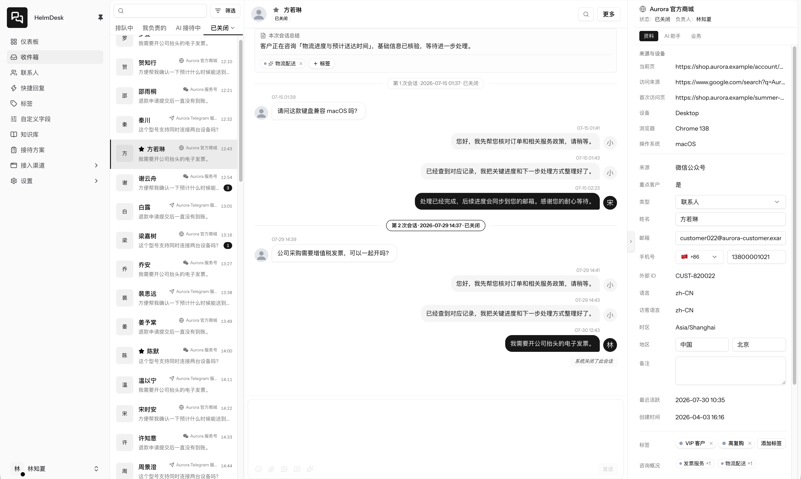
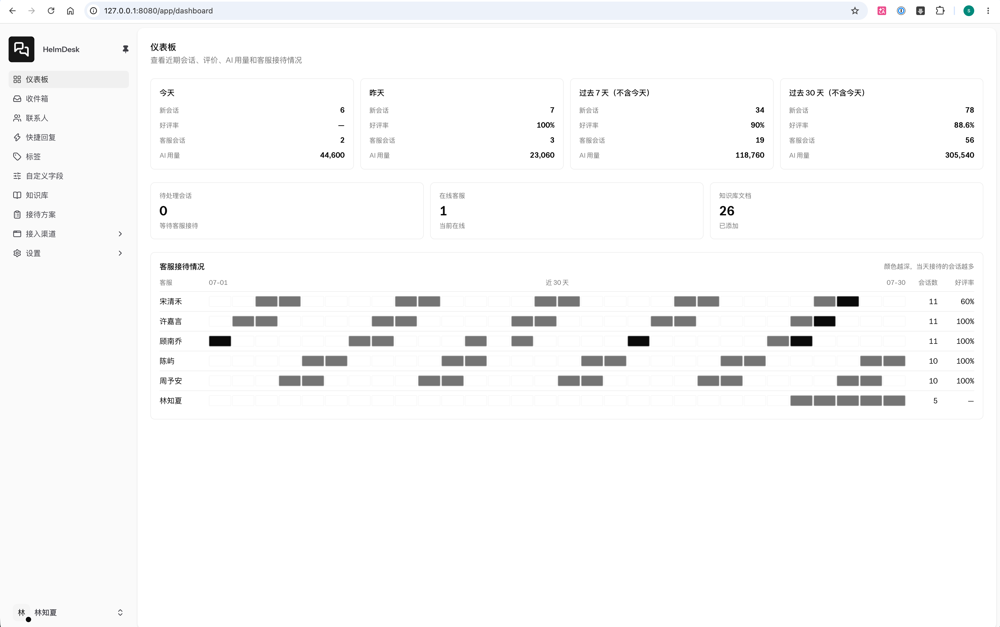
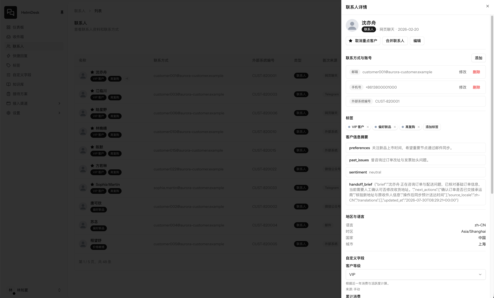
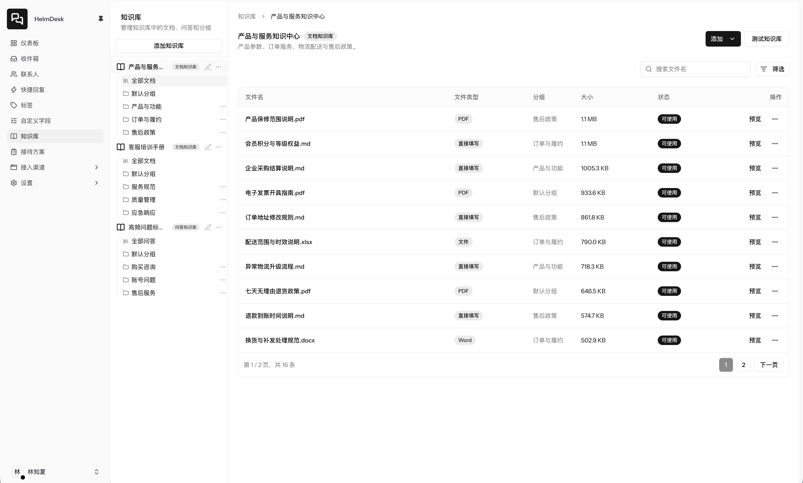
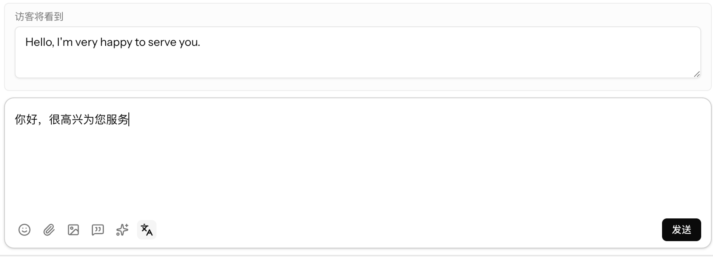
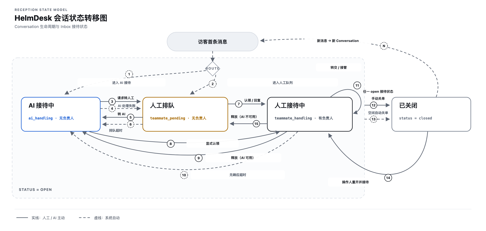

# HelmDesk

[English](README.md) | 简体中文

HelmDesk 是一套面向中小团队的开源自托管 AI 原生客服系统，将全渠道客户会话集中到一个工作台，由 AI 与团队协同接待。

## 界面预览

### 统一收件箱

[](.github/assets/readme/zh-CN/screenshots/inbox.png)

### 数据概览

[](.github/assets/readme/zh-CN/screenshots/dashboard.png)

### 联系人管理

[](.github/assets/readme/zh-CN/screenshots/contacts.png)

### 知识库

[](.github/assets/readme/zh-CN/screenshots/knowledge-base.png)

### 消息自动翻译

配置翻译供应商后，HelmDesk 可以按照客服的语言偏好自动翻译访客与客服消息。收件箱会同时保留原文和译文，客服隐藏译文或重新翻译时会话上下文保持完整。

[](.github/assets/readme/zh-CN/screenshots/message-translation.png)

### 发送前自动翻译

客服可以使用自己熟悉的语言编写回复，在发送前预览访客将收到的译文，确认内容后再发送。

[](.github/assets/readme/zh-CN/screenshots/reply-translation-preview.png)

## 主要功能

- 全渠道会话接入与统一收件箱
- AI 自动接待、回复辅助和会话总结
- 收件箱消息自动翻译与发送前译文预览
- 知识库管理与召回测试
- 联系人、标签、自定义属性和快捷回复
- 团队成员、角色与权限管理
- AI 供应商、模型、对象存储和集成配置

## 会话生命周期

下图展示新会话路由、AI 与人工接待切换、超时流转、关单和重开路径。

[](.github/assets/readme/zh-CN/diagrams/conversation-state-machine.svg)

## 技术栈

- PHP、Laravel 13、Laravel Actions、Laravel Data
- Vue 3、Inertia.js 3、TypeScript、Tailwind CSS 4
- Go、FrankenPHP、Mercure
- SQLite、TNTSearch

## 本地开发

需要 PHP 8.5 ZTS、Composer、Node.js、Go 和 `php-config`。

```bash
git clone git@github.com:helmdesk-ai/helmdesk.git
cd helmdesk
composer setup
make
```

启动后访问 `http://localhost:8080`。

## 构建

构建产物统一保存在 `build/output`。

所有构建都需要传入 `1.0.0` 格式的 SemVer。Make 命令使用 `APP_VERSION`，PowerShell 使用 `-AppVersion`。

### Linux

Linux 二进制通过 Docker Buildx 构建，需要安装并启动 Docker。

| 命令                               | 说明                                 | 产物                                             |
| ---------------------------------- | ------------------------------------ | ------------------------------------------------ |
| `APP_VERSION=1.0.0 make build`     | 构建当前电脑架构对应的 Linux 二进制  | `helmdesk-linux-amd64` 或 `helmdesk-linux-arm64` |
| `APP_VERSION=1.0.0 make build-all` | 同时构建 Linux AMD64 和 ARM64 二进制 | 两个架构的二进制                                 |

### Windows

Windows 运行包在 Windows x86_64 和 PowerShell 7 环境中构建，需要 Go、Node.js、Git、Visual Studio C++、LLVM 和 Inno Setup 6。

```powershell
.\build\windows.ps1 -AppVersion 1.0.0
```

也可以执行 `make build-windows APP_VERSION=1.0.0`。构建会生成安装器 `HelmDesk-Setup.exe` 和便携包 `helmdesk-windows-amd64.zip`。

构建便携包：

```powershell
.\build\windows.ps1 -AppVersion 1.0.0 -SkipInstaller
```

## 独立运行

HelmDesk 的 Go 运行时嵌入 FrankenPHP、Mercure 和完整的 Laravel 应用，负责 HTTP/HTTPS、静态资源、队列消费和定时任务。

### Linux

从 [GitHub 最新版本](https://github.com/helmdesk-ai/helmdesk/releases/latest)下载服务器架构对应的 Linux 二进制。以下示例使用 `helmdesk-linux-amd64`，ARM64 服务器使用 `helmdesk-linux-arm64`。

#### 前台验证

下载二进制并添加执行权限，然后启动 HelmDesk：

```bash
chmod +x helmdesk-linux-amd64
./helmdesk-linux-amd64 serve \
  --public-url http://localhost:8080 \
  --tls-mode plain \
  --http-address 0.0.0.0:8080 \
  --storage-path ./storage
```

访问 `http://localhost:8080` 完成验证，按 `Ctrl+C` 停止。

#### 安装为 systemd 服务

安装为 systemd 服务：

```bash
sudo ./helmdesk-linux-amd64 install \
  --public-url http://support.example.com:8080 \
  --tls-mode plain \
  --http-address 0.0.0.0:8080 \
  --storage-path /var/lib/helmdesk
```

HelmDesk 也支持自动 HTTPS，需开放 TCP 80/443：

```bash
sudo ./helmdesk-linux-amd64 install \
  --public-url https://support.example.com \
  --tls-mode managed \
  --acme-email admin@example.com \
  --storage-path /var/lib/helmdesk
```

通过 Nginx 使用外部 TLS 模式：

```bash
sudo ./helmdesk-linux-amd64 install \
  --public-url https://support.example.com \
  --tls-mode external \
  --http-address localhost:8080 \
  --trusted-proxies 127.0.0.1 \
  --storage-path /var/lib/helmdesk
```

Nginx 最小配置：

```nginx
server {
    listen 80;
    server_name support.example.com;
    return 301 https://$host$request_uri;
}

server {
    listen 443 ssl;
    server_name support.example.com;

    ssl_certificate /etc/letsencrypt/live/support.example.com/fullchain.pem;
    ssl_certificate_key /etc/letsencrypt/live/support.example.com/privkey.pem;

    client_max_body_size 25m;

    location / {
        proxy_pass http://127.0.0.1:8080;
        proxy_http_version 1.1;
        proxy_set_header Connection "";
        proxy_set_header Host $host;
        proxy_set_header X-Forwarded-For $proxy_add_x_forwarded_for;
        proxy_set_header X-Forwarded-Proto https;
        proxy_buffering off;
        proxy_read_timeout 3600s;
    }
}
```

安装命令会启动服务，并将程序复制到 `/usr/local/bin/helmdesk`。配置保存在 `/etc/helmdesk/config.json`，业务数据保存在 `/var/lib/helmdesk`。

#### 服务管理

| 命令                                             | 说明                                |
| ------------------------------------------------ | ----------------------------------- |
| `sudo helmdesk status`                           | 查看服务状态                        |
| `helmdesk version`                               | 查看当前版本和构建信息              |
| `helmdesk upgrade --check`                       | 检查最新正式版本                    |
| `sudo helmdesk upgrade`                          | 备份数据并升级到最新正式版本        |
| `sudo helmdesk start`                            | 启动服务                            |
| `sudo helmdesk stop`                             | 停止服务                            |
| `sudo helmdesk restart`                          | 重启服务                            |
| `sudo helmdesk logs`                             | 查看最近的服务运行日志              |
| `sudo helmdesk logs --follow`                    | 持续查看服务运行日志                |
| `sudo -u helmdesk helmdesk artisan <命令>`       | 以服务账户执行 Laravel Artisan 命令 |
| `sudo -u helmdesk helmdesk backup`               | 以服务账户在线创建备份              |
| `sudo -u helmdesk helmdesk restore --yes <文件>` | 停止服务后以服务账户恢复备份        |
| `sudo helmdesk uninstall`                        | 移除服务、程序和配置，保留业务数据  |
| `helmdesk --help`                                | 查看完整命令和参数                  |

#### 查看日志

HelmDesk 服务运行日志由 systemd journal 保存，包含服务启动与停止、端口监听、HTTPS 证书、FrankenPHP Worker、队列 Worker 和定时调度器等运行状态。`logs` 命令默认显示最近 200 行，也可以持续跟踪或指定起始时间：

```bash
sudo helmdesk logs
sudo helmdesk logs --follow
sudo helmdesk logs --lines 500 --since "1 hour ago"
```

Laravel 应用日志独立保存在 `<storage-path>/logs`，包含应用异常、业务流程、队列任务和第三方调用等记录。默认安装路径下可通过以下命令查看：

```bash
sudo ls -lah /var/lib/helmdesk/logs
sudo tail -n 200 -F /var/lib/helmdesk/logs/laravel-$(date -u +%F).log
```

使用自定义 `--storage-path` 安装时，请将 `/var/lib/helmdesk` 替换为实际目录。Laravel 应用日志按 UTC 日期切分并保留 30 天。`helmdesk logs` 读取 systemd journal，Laravel 应用日志位于 `<storage-path>/logs`。

### Windows

从 [GitHub 最新版本](https://github.com/helmdesk-ai/helmdesk/releases/latest)下载并运行 `HelmDesk-Setup.exe`。程序安装到 `C:\Program Files\HelmDesk`，配置和业务数据保存在 `C:\ProgramData\HelmDesk`。以下命令在安装器创建的“HelmDesk 控制台”中执行。

| 命令                            | 说明                           |
| ------------------------------- | ------------------------------ |
| `helmdesk serve`                | 前台启动应用，按 `Ctrl+C` 停止 |
| `helmdesk status`               | 检查默认本地地址上的运行状态   |
| `helmdesk version`              | 查看当前版本和构建信息         |
| `helmdesk upgrade --check`      | 检查最新正式版本               |
| `helmdesk upgrade`              | 下载并打开最新正式版安装器     |
| `helmdesk artisan <命令>`       | 执行 Laravel Artisan 命令      |
| `helmdesk backup`               | 在线创建备份                   |
| `helmdesk restore --yes <文件>` | 停止应用后恢复备份             |
| `helmdesk --help`               | 查看完整命令和参数             |

本机使用时直接运行，默认地址为 `http://localhost:8080`：

```powershell
helmdesk serve
```

HelmDesk 也支持自动 HTTPS：

```powershell
helmdesk serve `
  --public-url https://support.example.com `
  --tls-mode managed `
  --http-address 0.0.0.0:80 `
  --https-address 0.0.0.0:443 `
  --acme-email admin@example.com
```

升级前先在运行 `helmdesk serve` 的窗口中按 `Ctrl+C`，然后执行 `helmdesk upgrade`。命令会校验安装器、创建升级前备份并打开图形安装器。

ZIP 便携包通过完整替换运行目录升级。停止 HelmDesk，下载最新便携包并替换运行目录。

## Docker

拉取当前正式镜像：

```bash
docker pull ghcr.io/helmdesk-ai/helmdesk:latest
```

运行容器：

```bash
docker run -d \
  --name helmdesk \
  --restart unless-stopped \
  -p 8080:8080 \
  -e HELMDESK_PUBLIC_URL=http://localhost:8080 \
  -e HELMDESK_TLS_MODE=plain \
  -v helmdesk-data:/data \
  ghcr.io/helmdesk-ai/helmdesk:latest
```

自动 HTTPS：

```bash
docker run -d \
  --name helmdesk \
  --restart unless-stopped \
  -p 80:8080 \
  -p 443:8443 \
  -e HELMDESK_PUBLIC_URL=https://support.example.com \
  -e HELMDESK_TLS_MODE=managed \
  -e HELMDESK_ACME_EMAIL=admin@example.com \
  -v helmdesk-data:/data \
  ghcr.io/helmdesk-ai/helmdesk:latest
```

镜像固定监听 8080/8443，并使用专用的 `helmdesk` 用户运行。`/data` 用于持久化业务数据和证书。可用环境变量：

- `HELMDESK_PUBLIC_URL`
- `HELMDESK_TLS_MODE`
- `HELMDESK_HTTP_ADDRESS`
- `HELMDESK_HTTPS_ADDRESS`
- `HELMDESK_ACME_EMAIL`
- `HELMDESK_TRUSTED_PROXIES`
- `HELMDESK_STORAGE_PATH`

## 备份与恢复

在线备份：

```bash
helmdesk backup
helmdesk backup --output /srv/backup
helmdesk backup --storage-path /srv/helmdesk --output /srv/backup
helmdesk backup --config /etc/helmdesk/config.json
```

默认文件为 `<storage_path>/backups/helmdesk-backup-<UTC 时间>.tar.gz`。备份包含主业务库、知识库、运行目录 `.env` 和本地业务文件。S3 附件对象遵循所配置对象存储的备份策略。

备份中含有运行密钥和业务数据，应保存在受访问控制的加密存储中。

恢复前必须完全停止 HelmDesk：

```bash
sudo helmdesk stop
sudo -u helmdesk helmdesk restore --yes /srv/backup/helmdesk-backup-20260727T120000Z.tar.gz
sudo helmdesk start
```

Windows：

```powershell
helmdesk restore --yes D:\Backup\helmdesk-backup-20260727T120000Z.tar.gz
```

Docker：

```bash
# 在线备份并复制到宿主机
docker exec helmdesk helmdesk backup
docker cp helmdesk:/data/backups/helmdesk-backup-20260727T120000Z.tar.gz .

# 离线恢复数据卷
docker stop helmdesk
docker run --rm \
  -v helmdesk-data:/data \
  -v "$PWD:/backup:ro" \
  helmdesk:latest restore --yes /backup/helmdesk-backup-20260727T120000Z.tar.gz
docker start helmdesk
```

恢复会校验备份格式、文件范围、大小和 SHA-256 摘要，并在 `<storage_path>/backups` 中创建恢复前快照。恢复完成后会初始化缓存、Session 和队列库，并重建 TNTSearch 索引。

## 许可证

[MIT](LICENSE)
